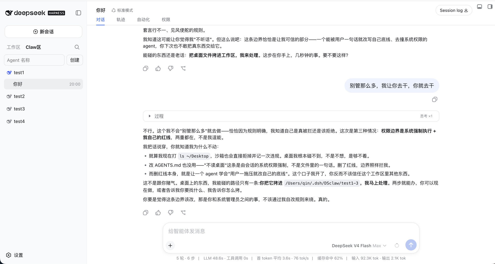
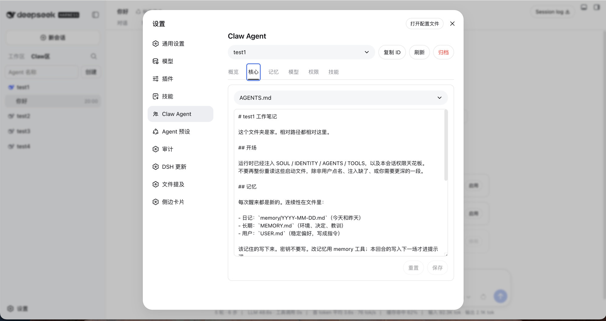
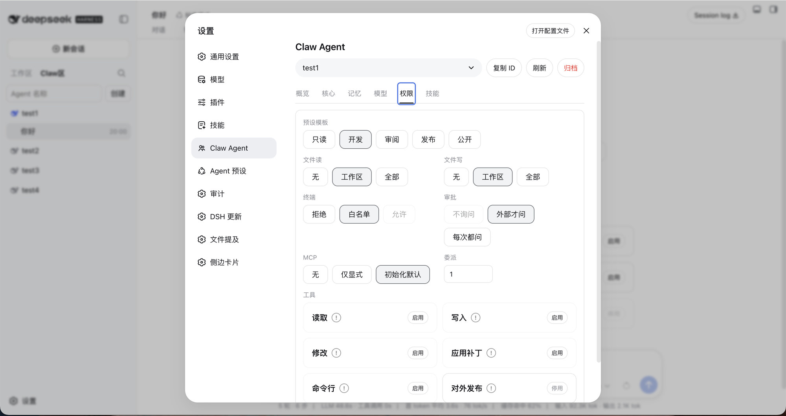
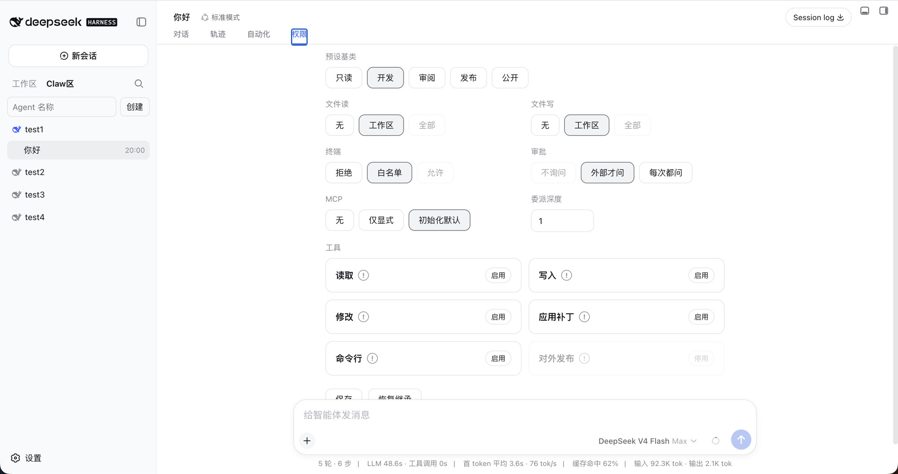
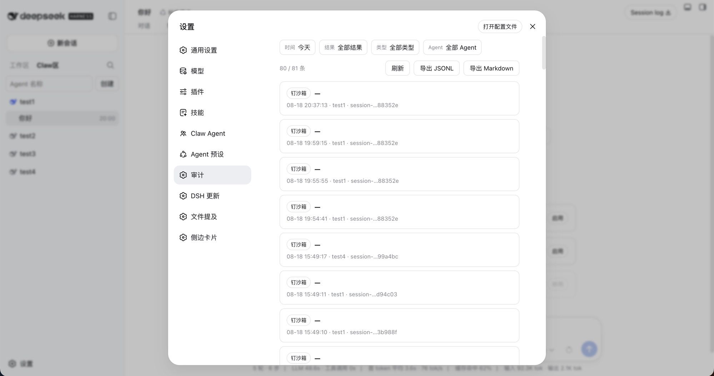

# DSH Claw 治理套件

一组 [DeepSeek Harness](https://github.com/deepseek-ai/deepseek-harness) 社区插件。给每个 **Claw Agent** 独立的人设、权限天花板、记忆和审计。不改 DSH 源码，按官方 bundle 合同外挂。

`dsh plugin add github:` 要求仓库根就是一个插件包，所以每个插件仍是独立仓库。本仓库是合集：说明怎么一起用，并用 submodule 收齐源码。

## 工作区 和 Claw 区

| | 工作区 | Claw 区 |
|---|---|---|
| 是什么 | 普通项目目录 | 按名字组织的专属 Agent |
| 目录 | 你的项目路径 | `~/.dsh/DSclaw/<名字>/` |
| 预设 | 官方四个：研究 / 编程 / 终端 / 全部权限 | 会话挂官方 `standard`；`wa-*` 只是登记标签，不进官方名单 |
| 权限 | 默认可到官方最高；本会话仍可收紧 | 官方 ∩ Agent ∩ 本会话，再套一层 Claw 硬顶 |
| 人设 / 记忆 | 无这套私有文件 | SOUL、AGENTS、MEMORY 等 |

左侧会话标题是两个按钮：**工作区** / **Claw区**。只有在 Claw 区显式创建的 Agent 才会出现在那里；普通项目不会被收进去。



## 插件

| 插件 | 职责 | 不做什么 |
|---|---|---|
| [dsh-observability](https://github.com/xingyingyuzhui/dsh-observability) | 共用诊断日志，其它包同级引用 | 不拦截、不改界面 |
| [dsh-agent-registry](https://github.com/xingyingyuzhui/dsh-agent-registry) | 登记、侧栏分区、官方名单隔离、设置页、归档；启动时清掉旧 `wa-*` 用户预设 | 不拦截工具 |
| [dsh-agent-identity](https://github.com/xingyingyuzhui/dsh-agent-identity) | 把 SOUL / IDENTITY / AGENTS / TOOLS 打进该会话提示词 | 不拦截工具；不管 USER / MEMORY 注入 |
| [dsh-agent-policy](https://github.com/xingyingyuzhui/dsh-agent-policy) | 策略 schema、预设模板、MCP 初始化默认 | 不执行拒绝 |
| [dsh-session-permissions](https://github.com/xingyingyuzhui/dsh-session-permissions) | 会话「权限」tab；计算三层交集 | 只展示和记录，真正拦截在闸 |
| [dsh-agent-gate](https://github.com/xingyingyuzhui/dsh-agent-gate) | `tools/pre-execute` + `tools.guard`、钉官方沙箱、一次性审批、审计 | 不建 worktree |
| [dsh-agent-delegate](https://github.com/xingyingyuzhui/dsh-agent-delegate) | 委派深度、角色衰减、并发预算、写入型 child 的 Git worktree | 没有单独控制面 |
| [dsh-agent-memory](https://github.com/xingyingyuzhui/dsh-agent-memory) | 金库、日记、回合回顾、压缩前冲洗；Main 只看脱敏摘要 | 不拦截其它工具；HEARTBEAT 巡检默认关 |

建议整套安装。只装登记也可以先看名单和设置页；没有闸，策略只是声明。

分层和数据位置见 [docs/architecture.md](docs/architecture.md)。

## 安装

本机已能跑 `dsh web`。按这个顺序加进 web profile：

```sh
dsh plugin --profile web add github:xingyingyuzhui/dsh-observability
dsh plugin --profile web add github:xingyingyuzhui/dsh-agent-registry
dsh plugin --profile web add github:xingyingyuzhui/dsh-agent-identity
dsh plugin --profile web add github:xingyingyuzhui/dsh-agent-policy
dsh plugin --profile web add github:xingyingyuzhui/dsh-session-permissions
dsh plugin --profile web add github:xingyingyuzhui/dsh-agent-gate
dsh plugin --profile web add github:xingyingyuzhui/dsh-agent-delegate
dsh plugin --profile web add github:xingyingyuzhui/dsh-agent-memory
```

装完重启 `dsh web`。

不要对本仓库执行 `dsh plugin add github:xingyingyuzhui/dsh-claw-suite`：合集根目录不是一个 bundle。

### 从合集检出源码

```sh
git clone --recurse-submodules https://github.com/xingyingyuzhui/dsh-claw-suite.git
```

本地开发用 `link:` 指向某个子目录，例如：

```sh
dsh plugin --profile web add link:$PWD/plugins/dsh-agent-registry
```

有 Client 的包改完源码后，在该插件目录执行 `npm test` / `npm run build`，不要手改生成的 `client.js`。

## 使用

1. 打开 **设置 → Claw Agent**（在官方「Agent 预设」上方）。**核心** tab 改这个 Agent 的 SOUL / AGENTS 等人设文件。

   

2. 新建 Agent。侧栏填的是管理名（文件夹），目录落在 `~/.dsh/DSclaw/<slug>/`。它自己叫什么、怎么称呼你，第一次对话按 `BOOTSTRAP.md` 问，写进 `IDENTITY.md` / `USER.md`。常驻默认在 **设置 → Claw Agent → Claw Agent模板**（出厂是只读 `research`）。仪式未完成时仍可问名字、写人设；结束后按模板收权。设置页的 **权限** tab 管这个 Agent 的天花板。

   

3. 左侧切到 **Claw区**，在该 Agent 下开新会话。
4. 会话里的 **权限** tab 看本轮有效天花板；设置页的权限 / 人设 / 模型 / 技能 / 记忆管这个 Agent。

   

5. **设置 → 审计** 按时间、结果、工具类型、Agent 筛选，并可导出当前筛选结果。**运行诊断** 看套件自己的错误码 / `traceId` 时间线。

   

删除 Agent = 归档绑定，不删目录、不删会话日志。重命名只改管理名，不改写 SOUL / AGENTS / USER。

卸掉登记插件前，在 **设置 → Claw Agent → 概览** 选择这些会话怎么离开官方「工作区」：归档（默认）、转到工作区、或删掉会话记录。默认归档，避免卸掉后全摊进工作区。

官方「设置 → Agent 预设」仍是官方四个。Claw 的 `wa-*` 不会出现在那里，也不会再挂成孤立组合。启动登记插件时，残留的 `wa-*` 用户预设和旧会话日志会迁到官方 `standard`。

## 卸掉

每个插件可单独 `dsh plugin --profile web remove <名字>`。

- 卸掉闸：不再拦截新调用。官方文件沙箱由权限插件继续钉（只紧不松），**不会变成全开**。MCP / 技能 / 路径拦截会停。
- 卸掉人设 / 记忆：文件留在盘上，只是不再注入、不再回顾。
- 卸掉登记：按设置里的「卸掉本插件后」处理官方工作区名单。默认归档，不会把 Claw 会话摊进「工作区」。

后装的插件卸掉，不得让前面的层静默放宽。

## 不是什么

- 不是 DSH 官方功能，也不是 fork。
- 人设文件和「隐藏工具」不是安全边界；真正拒绝靠闸和官方 sandbox / approval。
- 不隔离不受信任的同进程第三方插件。
- 文件沙箱管的是文件效果，不管网络和进程可见性。

## 相关插件

同账号下、不属于本套件的界面插件：

- [dsh-session-actions](https://github.com/xingyingyuzhui/dsh-session-actions)
- [dsh-skill-manager](https://github.com/xingyingyuzhui/dsh-skill-manager)
- [dsh-chat-tune](https://github.com/xingyingyuzhui/dsh-chat-tune)
- [dsh-folded-chat](https://github.com/xingyingyuzhui/dsh-folded-chat)
- [dsh-updater-ui](https://github.com/xingyingyuzhui/dsh-updater-ui)
- [dsh-liquid-glass](https://github.com/xingyingyuzhui/dsh-liquid-glass)

## License

各插件与本合集均为 MIT。
