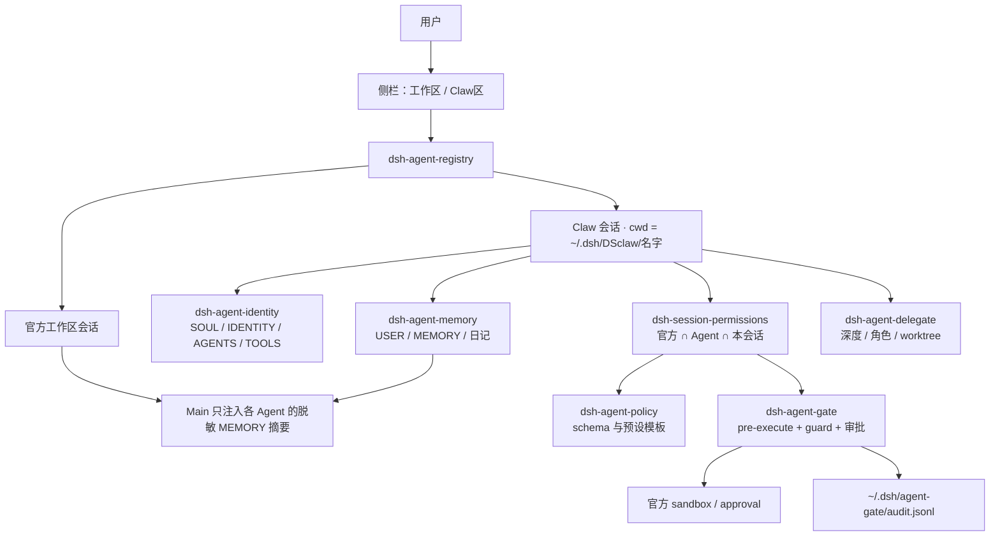

# 架构

本文说明合集里七个插件如何叠在一起。实现细节以各插件仓库为准。

## 总览



## 身份与目录

Claw Agent 的稳定事实是 **slug（名字）→ 目录 → 会话**，不是「当前打开的项目文件夹」。

| 路径 | 内容 |
|---|---|
| `~/.dsh/workspace-agents/registry.json` | 绑定、归档、Agent 元数据 |
| `~/.dsh/DSclaw/<slug>/` | 该 Agent 的家 |
| `SOUL.md` / `IDENTITY.md` / `AGENTS.md` / `TOOLS.md` | 每轮打进系统提示 |
| `USER.md` / `MEMORY.md` / `memory/YYYY-MM-DD.md` | 记忆插件管理；开场按长度上限注入 |
| `HEARTBEAT.md` | 只存盘。默认 `every: 0`，这套插件不会空闲巡检 |
| `policy.json` | 该 Agent 的权限声明 |
| `~/.dsh/session-permissions/<sessionId>.json` | 本会话覆盖 |
| `~/.dsh/agent-policy/defaults.json` | 新 Agent 的 MCP 初始化默认 |
| `~/.dsh/agent-memory/settings.json` | 记忆审批 / 回顾开关 |
| `~/.dsh/agent-gate/audit.jsonl` | 闸的审计 |

创建 Agent 时从用户预设模板 `wa-template`（显示名 **claw区agent模板**）复制出 `wa-<slug>`，新会话带上这个预设。删除 = 归档绑定。重命名只改管理名，不改写人设文件。

官方工作区列表和会话搜索会丢掉 Claw 项，避免它们掉进「未分组」。官方「Agent 预设」名单也不返回 `wa-*`。缺了的 `wa-*` 在解析时回落到官方 `standard`，避免空白会话报 `preset not found`。

## 权限怎么算

有效权限取更严的一面：

```
工作区会话：官方预设（默认可到全部权限） ∩ 本会话覆盖
Claw 会话：官方预设 ∩ Claw 硬顶 ∩ Agent 策略 ∩ 本会话覆盖
```

任一层拒绝即拒绝。更低层不能把已经拿掉的能力补回来。

**Claw 硬顶**（会话到不了官方 `danger-full-access`）：

- 文件读 / 写最高到 `all`
- Shell 最高到 `allowlist`，不能是无限制 `allow`
- 发布工具可以打开
- 审批不能是 `never`

官方沙箱按有效策略钉死：

- `files.write === all` **且** `shell === allow` → `danger-full-access`（Claw 到不了这一档）
- 否则有写入 → `workspace-write`
- 否则 → `read-only`

闸在 `tools/pre-execute` 解释并拦截，在 `tools.guard` 做最终拒绝。拒绝回执要求模型不要换个说法重试。需要时走官方一次性审批；批准绑定这一次调用身份，改参数要重新问。

技能拒绝名单会从该会话的官方技能目录和 `/` 选单里拿掉，不只拦 `skill` 工具。

MCP 工具名是 `mcp__<服务>__<工具>`。`none` 全关；`explicit` 只放行 Agent 名单上的服务；`init-defaults` 在未写名单时放行，写了就按名单。闸会拒绝未授权服务，并在会话开始时从模型可见工具里拿掉它们。MCP 不再跟文件写/终端绑在一起：只读 Agent 仍可用初始化默认可调的检索类 MCP。

工具名按 OpenClaw：`read` / `write` / `edit` / `apply_patch` / `exec`（DSH 的 `bash` 是别名）。`str_replace_editor` 按 `command` 映射。bash 整类按 Shell 面拦截，不拆命令里的路径。

## 预设模板

`research` / `developer` / `reviewer` / `release` / `public` 是协助选择的模板，套用后仍可逐项改。新 Agent 默认 **research**（只读声明，`enforced: false`）。套用 developer 不会自动拿到无限制终端或发布权限。

Skill 只影响模型看得见的说明，不增加文件或 Shell 权限。

## 人设与记忆

`dsh-agent-identity` 只在 session cwd 位于 `DSclaw` 下时注入人设。`USER.md` / `MEMORY.md` / 日记由 `dsh-agent-memory` 在开场注入。

记忆插件另外提供 `memory` 工具（只挂在 Claw 会话）。回合结束后可做回顾；听到官方 `session/event` 的 `compaction/start` 时立刻把该写的写入金库。可设自由写或需审批。

官方 / Main 会话只注入各 Claw Agent 的脱敏 MEMORY 摘要：去掉凭据、注入语句、工具原文和 SOUL。Main 是控制面，不是可以读所有原文的超级执行 Agent。

## 委派

`dsh-agent-delegate` 叠在官方 `ctx.subagents` 上：

- 按父链计数深度，超过 `delegation.maxDepth` 拒绝（developer 默认 1）
- 角色必须在 `delegation.roles` 里；child = parent ∩ 角色预设
- 未结束的 child / 并行写入任务有并发上限
- 同一任务更新一代后，旧 child 的回报作废
- **仅**写入型 child 和后台写入任务进独立 Git worktree；主会话和前台 bash 继续写项目根
- 写入型 child 的 `files.write: all` 会收到 `workspace`
- `research` / `reviewer` / `public`（或 `sandbox.requireEnforcement: full`）在 sandbox 报告 `partial` 时拒绝文件动作，不降级放行

## 卸掉之后

每个插件可单独卸。闸卸掉后回落到 DSH 原有 permission-presets，不会变成全开。人设和记忆文件留在盘上。已钉进会话的官方沙箱模式不会因为卸闸而消失。

后加的层被拿掉，不得让有效权限静默变宽。

## 诚实边界

- 提示词、隐藏工具、人设红线都不是强制访问控制。
- 同进程第三方插件仍被信任。不可信租户需要进程 / 容器 / 远程 sandbox。
- 文件沙箱不管网络和进程可见性。
- 本机 sandbox 报 `partial` 时，要求 `full` 的角色必须停手。
